# JoyRoute 🗺️

**AI-Powered Trip Itinerary Planner**

JoyRoute is a collaborative trip planning application that helps travelers create, organize, and optimize their travel itineraries with intelligent AI suggestions and interactive maps.

---

## 👥 Voyage59 - Tier3 - Team33

| Name | Role | GitHub | LinkedIn |
|------|------|--------|----------|
| Samantha (Kayleigh) | Product Owner | [@samanthakgraham](https://github.com/samanthakgraham) | [Profile](https://www.linkedin.com/in/samantha-graham-339b6b37) |
| Min Sik Hein (Direwen) | Developer | [@Direwen](https://github.com/Direwen) | [Profile](https://www.linkedin.com/in/min-sik-hein/) |
| Chris | Developer | [@chalrees876](https://github.com/chalrees876) | [Profile](https://www.linkedin.com/in/cmckenzie12/) |
| Margaret Wu | UI/UX Designer | [@margaretcwu](https://github.com/margaretcwu) | [Profile](https://linkedin.com/in/margaretcwu) |
| Oshada Kularathne | Developer | [@devimalka](https://github.com/devimalka) | [Profile](https://www.linkedin.com/in/oshada-kularathne/) |
| Chanae Pickett | Agile Scrum Master | [@chanaelynease](https://github.com/chanaelynease) | - |
| Gobinath Varatharajan | Developer | [@gobinathvaratharajan](https://github.com/gobinathvaratharajan) | [Profile](https://www.linkedin.com/in/gobinathvaratharajan/) |

---


---

## ✨ Key Features

### 🤖 AI-Powered Planning
- **Smart Date Suggestions** - Get AI recommendations for when to schedule activities based on your itinerary
- **Route Optimization** - Automatically optimize daily routes for minimal travel time and distance
- **Distance Warnings** - Intelligent alerts when locations are far apart (>100km)

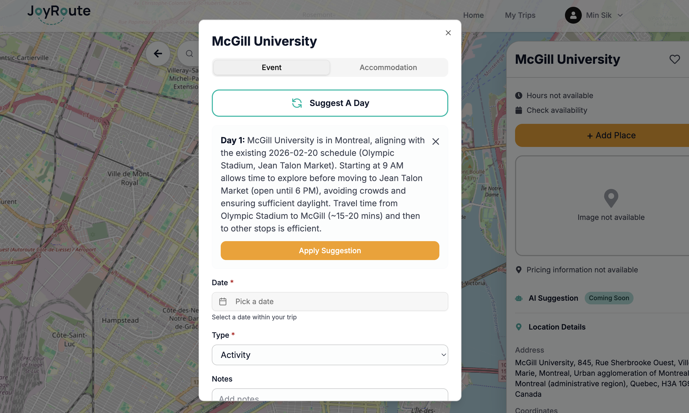

### 🗺️ Interactive Maps
- **Visual Itinerary** - See your entire trip on an interactive map with Leaflet/OpenStreetMap
- **Route Visualization** - View optimized routes connecting your daily activities
- **Place Search** - Search and discover locations using Nominatim geocoding

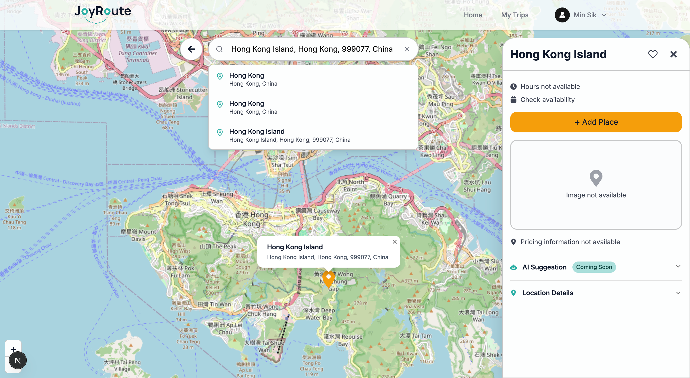

### 📅 Smart Itinerary Management
- **Day-by-Day Planning** - Organize events and activities by day with timeline view
- **Drag & Drop Reordering** - Easily reorganize your schedule with intuitive drag-and-drop
- **Event Categorization** - Classify activities (Activity, Meal, Flight, Train, Bus, Other)
- **Accommodation Tracking** - Manage lodging with date ranges


### 🎯 Trip Organization
- **Multiple Trips** - Plan and manage multiple trips simultaneously
- **Favorites System** - Save places you want to visit for quick access
- **Public Sharing** - Share your itinerary via public URL with friends and family

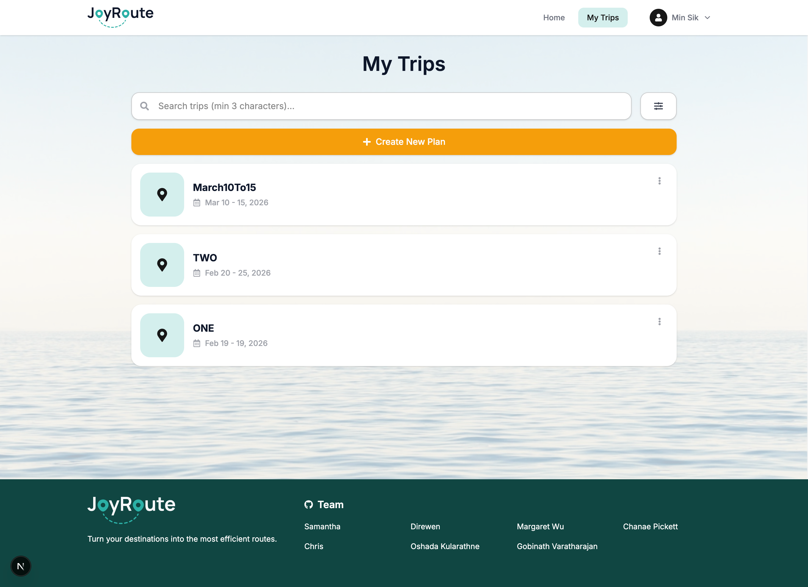

### ⚡ Optimized Experience
- **Route Optimization** - Get the most efficient route with distance and time statistics
- **Real-time Updates** - Instant UI updates with optimistic rendering
- **Responsive Design** - Seamless experience on desktop and mobile

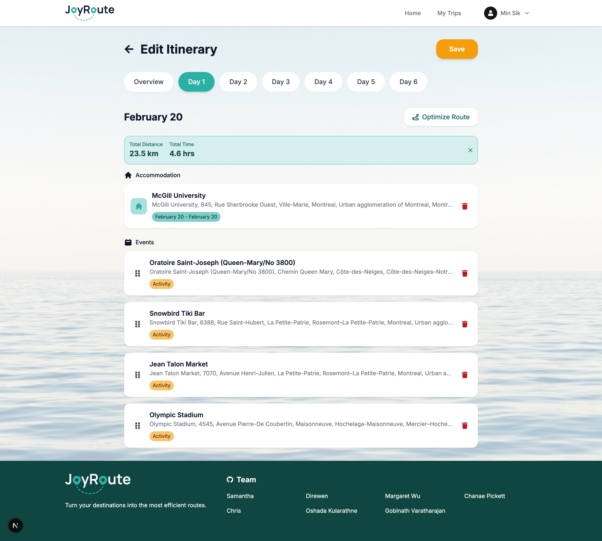

---

## � Mobile Responsive

JoyRoute is fully responsive and optimized for mobile devices.

<table>
  <tr>
    <td width="25%">
      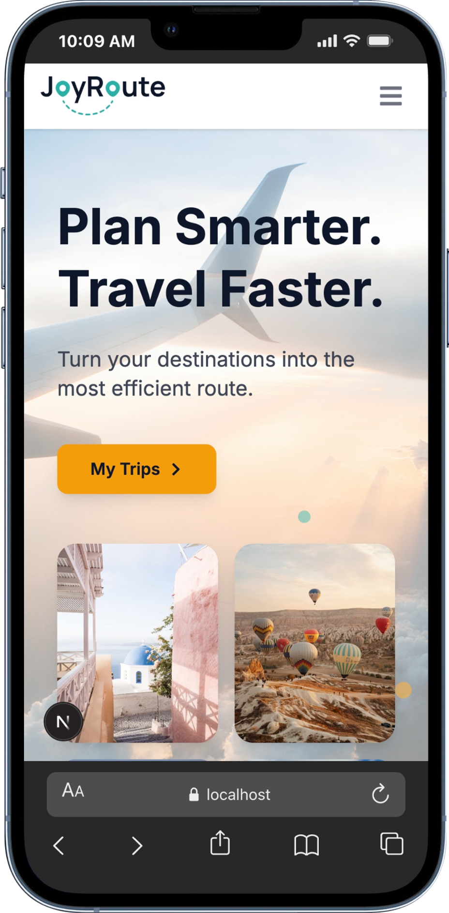
      <p align="center"><em>Home Page</em></p>
    </td>
    <td width="25%">
      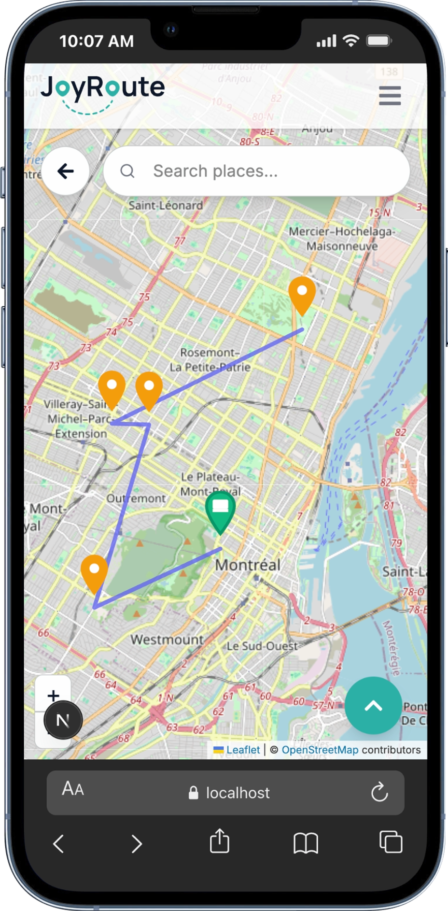
      <p align="center"><em>Trip Overview</em></p>
    </td>
    <td width="25%">
      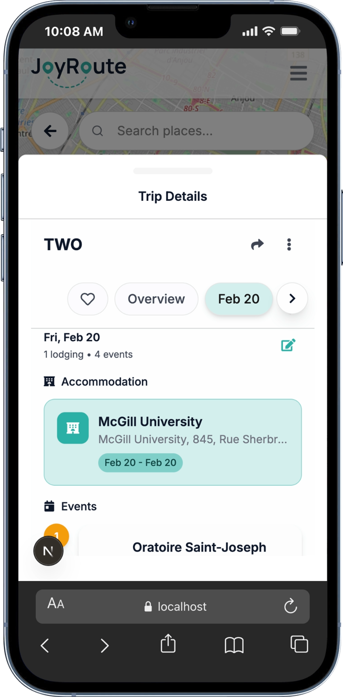
      <p align="center"><em>Day Details</em></p>
    </td>
    <td width="25%">
      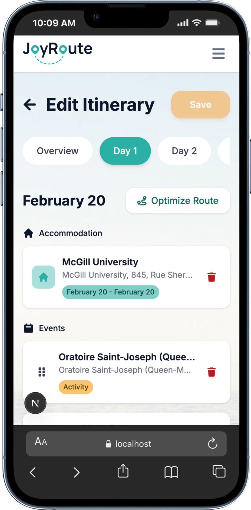
      <p align="center"><em>Edit Mode</em></p>
    </td>
  </tr>
</table>

---

## 📸 More Screenshots

<details>
<summary>Click to view more screenshots</summary>

### Registration
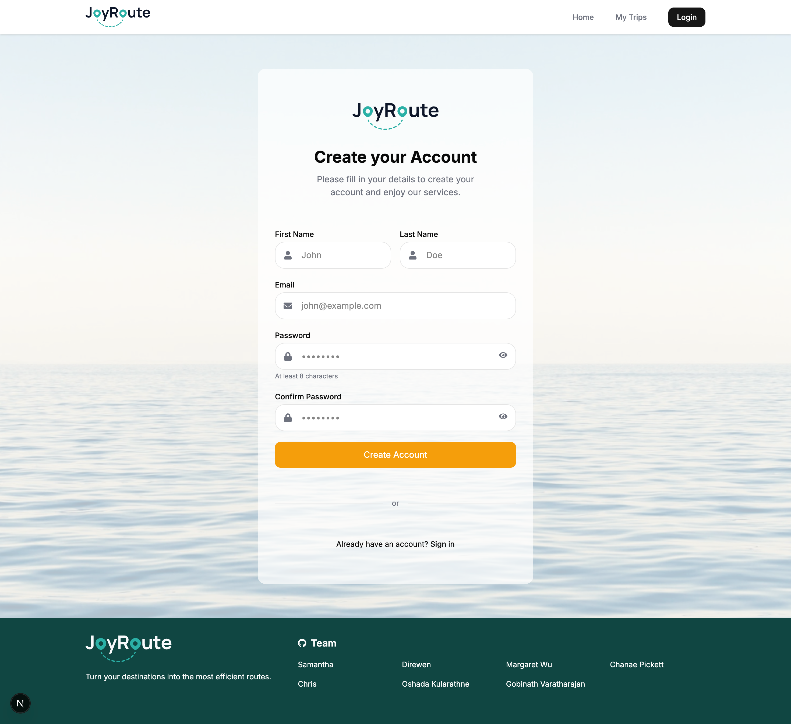

### Favorite Places
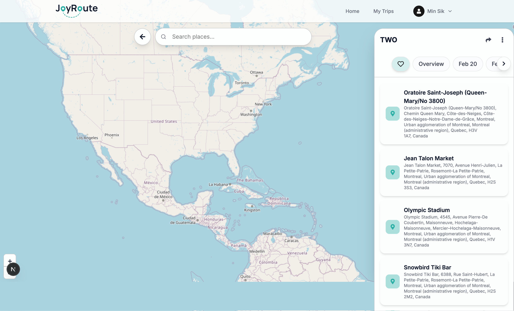

### Add Lodging
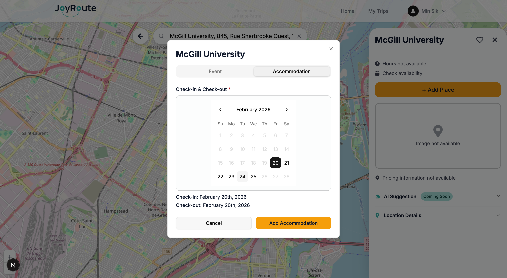

### Itinerary with Lodging


### Share Trip
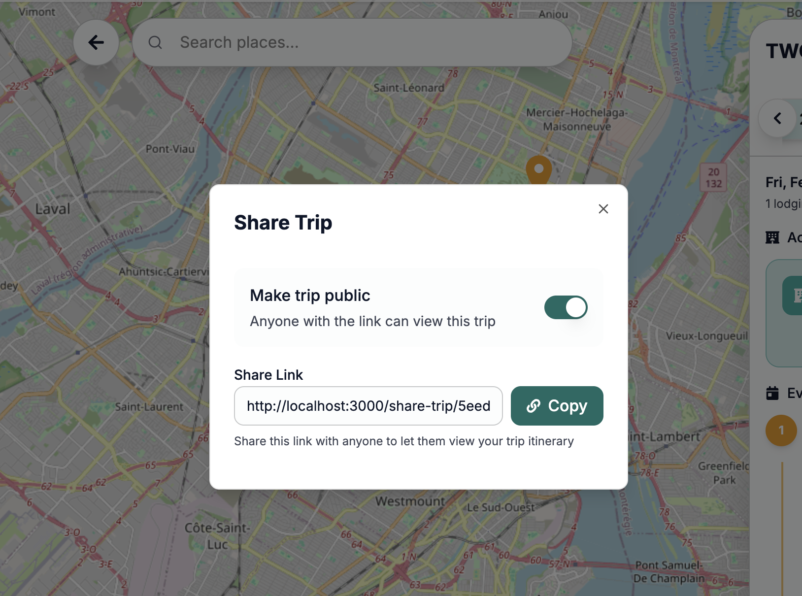

</details>

---

## 🛠️ Tech Stack

### Frontend
- **Next.js 16** (App Router) with **React 19**
- **TypeScript** for type safety
- **Tailwind CSS 4** with **shadcn/ui** components
- **Zustand** for state management
- **Leaflet** + **React Leaflet** for maps
- **dnd-kit** for drag & drop
- **Bun** as package manager

### Backend
- **Django 6.0** + **Django REST Framework**
- **Python 3.14** with **uv** package manager
- **JWT Authentication** (dj-rest-auth + django-allauth)
- **LangChain** + **Groq** for AI features
- **Geoapify API** for route optimization
- **drf-spectacular** for API documentation

### External Services
- **Nominatim** (OpenStreetMap) - Geocoding & place search
- **Geoapify** - Route optimization
- **Groq API** - LLM for AI date suggestions
- **Mailtrap** - Email testing (development)

---

## 🏗️ Architecture

### Entity Relationship Diagram

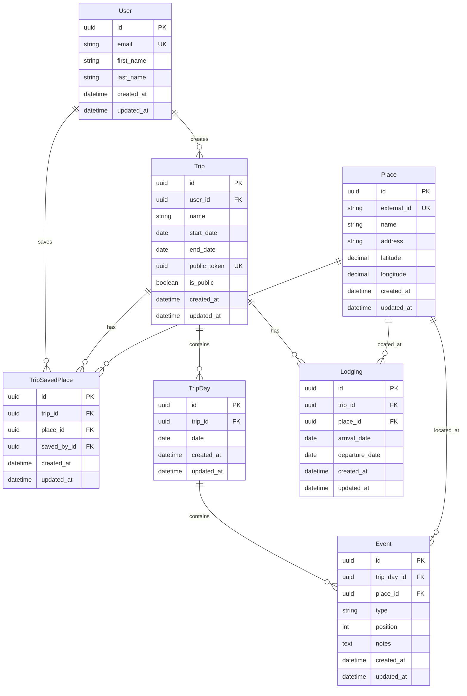
```mermaid
erDiagram
    User ||--o{ Trip : creates
    User ||--o{ TripSavedPlace : saves
    Trip ||--o{ TripDay : contains
    Trip ||--o{ TripSavedPlace : has
    Trip ||--o{ Lodging : has
    TripDay ||--o{ Event : contains
    Place ||--o{ TripSavedPlace : referenced_in
    Place ||--o{ Event : located_at
    Place ||--o{ Lodging : located_at

    User {
        uuid id PK
        string email UK
        string first_name
        string last_name
        datetime created_at
        datetime updated_at
    }

    Trip {
        uuid id PK
        uuid user_id FK
        string name
        date start_date
        date end_date
        uuid public_token UK
        boolean is_public
        datetime created_at
        datetime updated_at
    }

    TripDay {
        uuid id PK
        uuid trip_id FK
        date date
        datetime created_at
        datetime updated_at
    }

    Place {
        uuid id PK
        string external_id UK
        string name
        string address
        decimal latitude
        decimal longitude
        datetime created_at
        datetime updated_at
    }

    TripSavedPlace {
        uuid id PK
        uuid trip_id FK
        uuid place_id FK
        uuid saved_by_id FK
        datetime created_at
        datetime updated_at
    }

    Event {
        uuid id PK
        uuid trip_day_id FK
        uuid place_id FK
        string type
        int position
        text notes
        datetime created_at
        datetime updated_at
    }

    Lodging {
        uuid id PK
        uuid trip_id FK
        uuid place_id FK
        date arrival_date
        date departure_date
        datetime created_at
        datetime updated_at
    }
```

### Key Workflows

#### 1. Trip Creation & Planning Flow

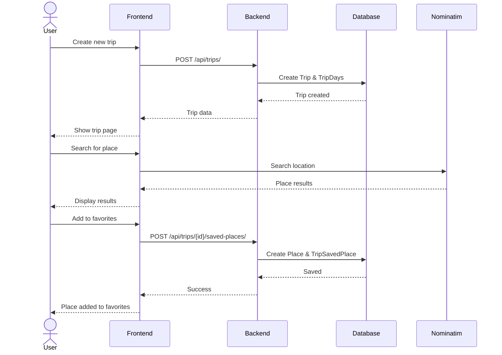
```mermaid
sequenceDiagram
    actor User
    participant Frontend
    participant Backend
    participant Database

    User->>Frontend: Create new trip
    Frontend->>Backend: POST /api/trips/
    Backend->>Database: Create Trip & TripDays
    Database-->>Backend: Trip created
    Backend-->>Frontend: Trip data
    Frontend-->>User: Show trip page

    User->>Frontend: Search for place
    Frontend->>Nominatim: Search location
    Nominatim-->>Frontend: Place results
    Frontend-->>User: Display results

    User->>Frontend: Add to favorites
    Frontend->>Backend: POST /api/trips/{id}/saved-places/
    Backend->>Database: Create Place & TripSavedPlace
    Database-->>Backend: Saved
    Backend-->>Frontend: Success
    Frontend-->>User: Place added to favorites
```

#### 2. AI Date Suggestion Flow

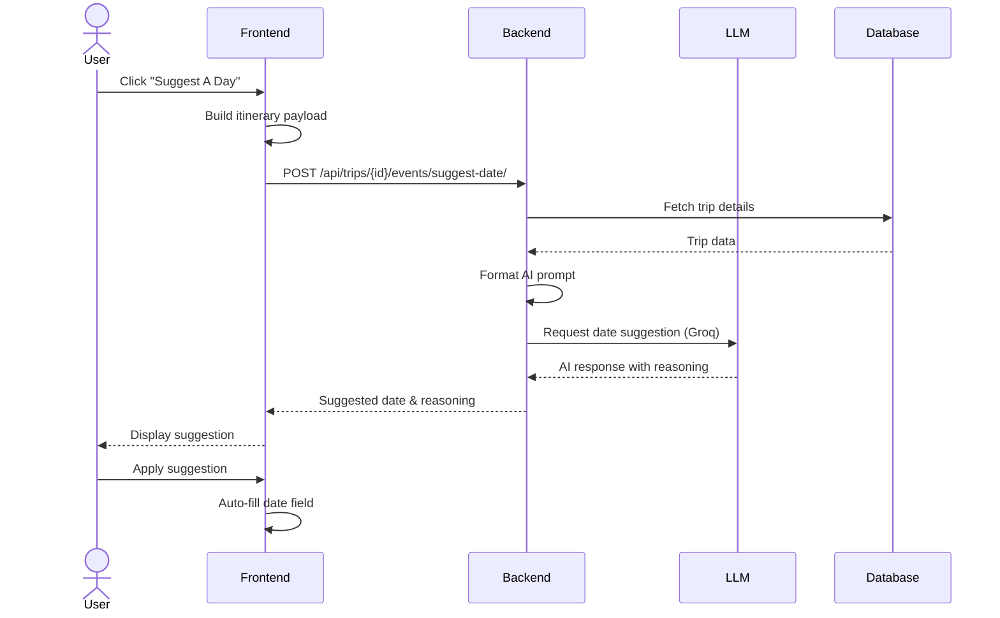
```mermaid
sequenceDiagram
    actor User
    participant Frontend
    participant Backend
    participant LLM
    participant Database

    User->>Frontend: Click "Suggest A Day"
    Frontend->>Frontend: Build itinerary payload
    Frontend->>Backend: POST /api/trips/{id}/events/suggest-date/
    Backend->>Database: Fetch trip details
    Database-->>Backend: Trip data
    Backend->>Backend: Format AI prompt
    Backend->>LLM: Request date suggestion (Groq)
    LLM-->>Backend: AI response with reasoning
    Backend-->>Frontend: Suggested date & reasoning
    Frontend-->>User: Display suggestion
    User->>Frontend: Apply suggestion
    Frontend->>Frontend: Auto-fill date field
```

#### 3. Route Optimization Flow

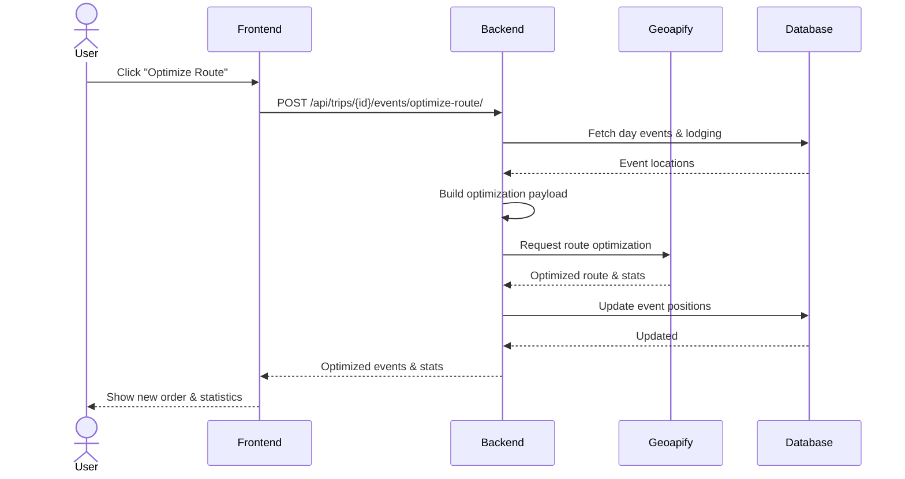
```mermaid
sequenceDiagram
    actor User
    participant Frontend
    participant Backend
    participant Geoapify
    participant Database

    User->>Frontend: Click "Optimize Route"
    Frontend->>Backend: POST /api/trips/{id}/events/optimize-route/
    Backend->>Database: Fetch day events & lodging
    Database-->>Backend: Event locations
    Backend->>Backend: Build optimization payload
    Backend->>Geoapify: Request route optimization
    Geoapify-->>Backend: Optimized route & stats
    Backend->>Database: Update event positions
    Database-->>Backend: Updated
    Backend-->>Frontend: Optimized events & stats
    Frontend-->>User: Show new order & statistics
```

#### 4. Public Trip Sharing Flow

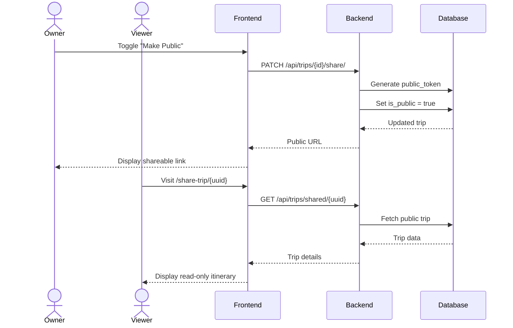
```mermaid
sequenceDiagram
    actor Owner
    actor Viewer
    participant Frontend
    participant Backend
    participant Database

    Owner->>Frontend: Toggle "Make Public"
    Frontend->>Backend: PATCH /api/trips/{id}/share/
    Backend->>Database: Generate public_token
    Backend->>Database: Set is_public = true
    Database-->>Backend: Updated trip
    Backend-->>Frontend: Public URL
    Frontend-->>Owner: Display shareable link

    Viewer->>Frontend: Visit /share-trip/{uuid}
    Frontend->>Backend: GET /api/trips/shared/{uuid}
    Backend->>Database: Fetch public trip
    Database-->>Backend: Trip data
    Backend-->>Frontend: Trip details
    Frontend-->>Viewer: Display read-only itinerary
```

---

## 🚀 Quick Start

### Prerequisites

- **Bun** (v1.0+) - [Install](https://bun.sh/docs/installation)
- **Python 3.14** (managed by uv)
- **uv** - [Install](https://github.com/astral-sh/uv)

### 1. Clone the Repository

```bash
git clone <repository-url>
cd joyroute
```

### 2. Backend Setup

```bash
cd backend

# Copy environment template
cp .env.example .env
# Edit .env with your API keys

# Install dependencies
uv sync

# Run migrations
uv run python manage.py migrate

# Start server
uv run python manage.py runserver
```

Backend runs at `http://localhost:8000`

### 3. Frontend Setup

```bash
cd frontend

# Copy environment template
cp .env.example .env
# Edit .env if needed

# Install dependencies
bun install

# Start development server
bun run dev
```

Frontend runs at `http://localhost:3000`

### 4. Get API Keys

You'll need API keys for full functionality:

- **Mailtrap** (Email): [Sign up](https://mailtrap.io/) - Free tier available
- **Geoapify** (Route optimization): [Get key](https://www.geoapify.com/) - Free tier: 3,000 requests/day
- **Groq** (AI suggestions): [Get key](https://console.groq.com/) - Free tier available

See [SETUP.md](./SETUP.md) for detailed setup instructions.

---

## 📚 Documentation

- **[Setup Guide](./SETUP.md)** - Detailed installation and configuration
- **[API Documentation](http://localhost:8000/api/schema/swagger-ui/)** - Swagger UI (when backend is running)
- **[Component Library](http://localhost:6006)** - Storybook (run `bun run storybook` in frontend)

---

## 🧪 Development

### Run Tests

```bash
# Frontend
cd frontend
bun test              # Watch mode
bun run test:run      # Single run

# Backend
cd backend
uv run python manage.py test
```

### Code Quality

```bash
# Frontend
bun run lint          # Check linting
bun run format        # Format code

# Backend
uv run ruff check     # Lint Python code
```

### View Components

```bash
cd frontend
bun run storybook     # Opens at http://localhost:6006
```

---

## 📁 Project Structure

```
joyroute/
├── backend/              # Django REST API
│   ├── apps/
│   │   ├── accounts/     # User authentication & management
│   │   ├── itineraries/  # Trip & event management
│   │   ├── places/       # Place data & favorites
│   │   └── core/         # Shared utilities
│   ├── api/              # API routing
│   ├── config/           # Django settings
│   └── templates/        # Email templates
├── frontend/             # Next.js application
│   ├── app/              # App router pages
│   │   ├── auth/         # Authentication pages
│   │   ├── trips/        # Trip management
│   │   └── share-trip/   # Public trip view
│   ├── components/       # React components
│   ├── store/            # Zustand state management
│   ├── services/         # API services
│   ├── utils/            # Helper functions
│   └── types/            # TypeScript types
└── docs/                 # Documentation & screenshots
```

---

## � Acknowledgments

- Built during **Chingu Voyage 59**
- **OpenStreetMap** for geocoding services
- **Geoapify** for route optimization
- **Groq** for AI capabilities

---

## 📝 License

This project was created as part of the Chingu Voyage program.
